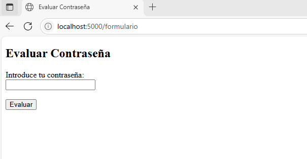
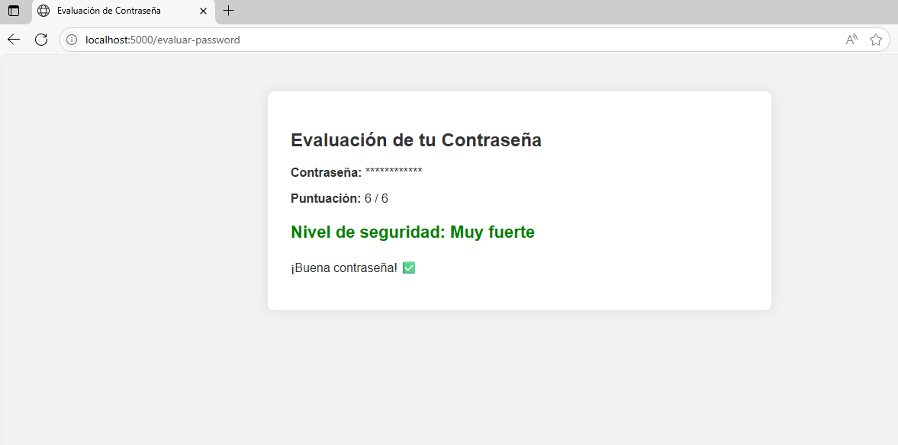
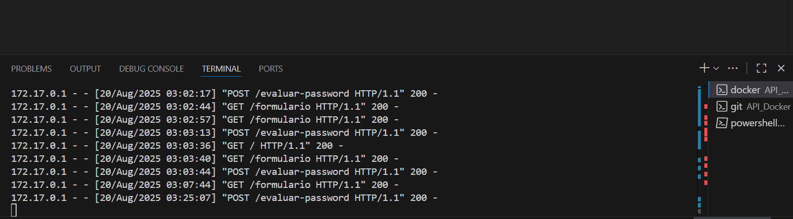
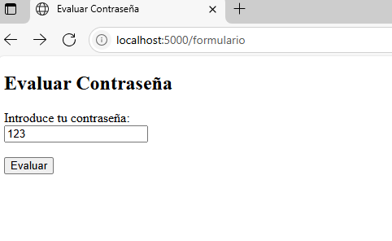
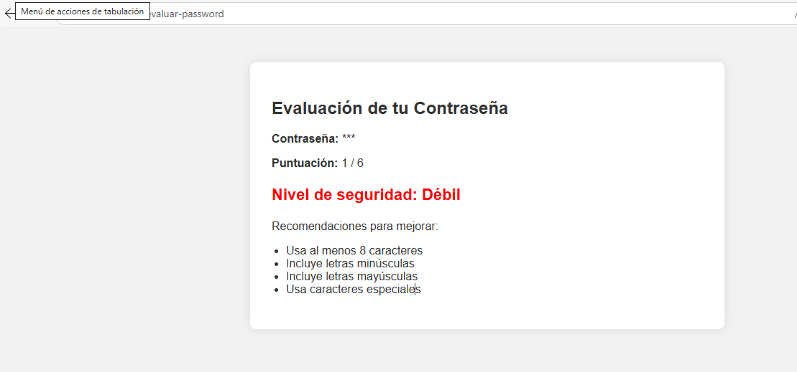

Se creo una aplicación web que permite validar si una contraseña es insegura o segura respecto a una serie de controles de contraseñas Seguras

## Procedimiento

1. Se creo una funcion Formulario que utiliza el metodo GET para mostrar un formulario que solicita el ingreso de una contraseña. 

2. Al dar click al boton evaluar, este envia la información otra función mediante el método POST para hacer la evaluación de la contraseña

3. Se validan las peticiones GET y POST realizadas

4. Validación de contraseña débil

